Hello 👋! As developers, we've all been there that frantic call or notification that an application is down because a secret or certificate has expired. It's a classic problem and a major pain point in the development lifecycle. What if I told you there's a better way to manage your app's credentials, a way that lets you ditch those pesky secrets and certificates for good?

That's where **Federated Identity Credentials (FIC)** come to the rescue! This feature in [Microsoft Entra ID](https://docs.azure.cn/en-us/entra/fundamentals/what-is-entra) (formerly AAD) lets your applications authenticate to Azure resources without needing to store any secrets or certificates. It's a game-changer for improving security and reducing operational headaches.

> [Deep dive on FIC in Microsoft Learn →](https://learn.microsoft.com/en-us/graph/api/resources/federatedidentitycredentials-overview?view=graph-rest-1.0)


## What is a Federated Identity Credential?

In our case, it's about trusting a workload (like a managed identity) to authenticate as a specific AAD app registration. Instead of using a secret or certificate, the workload presents a token to AAD, which verifies the trust and issues an access token for the app registration.

This means your application, now armed with this new access token, can authenticate to other Azure resources without a hitch. It's a secure, seamless, and secret-free way to manage your app's identity.

---

## Our Scenario: Ditching Secrets with a Managed Identity

Let's walk through a practical example of how to implement this. We'll use a **User-Assigned Managed Identity (UAMI)** to federate with an Azure App Registration. This UAMI will then be assigned to an Azure App Service, allowing our application to authenticate to other Azure resources.

Here's the flow we'll set up:

*   **Create an App Registration:** This will be the main identity of our application.
*   **Add a Federated Credential:** We'll add a FIC to the app registration, linking it to our UAMI.
*   **Assign the UAMI to the App Service:** The App Service will now use the UAMI.

Now, let's dive into the details.

### Step 1: Create an App Registration

First, you'll need an App Registration in your Azure Active Directory. This is the application's identity. Give it a name, and that's it! No need to create any secrets or certificates here.

### Step 2: Add the Federated Identity Credential

This is where the magic happens. Navigate to your App Registration, go to the Certificates & secrets blade, and click on the Federated credentials tab. Here, you'll add a new credential.

*   **Scenario:** Select Azure services
*   **Service:** Choose Managed identity
*   **Managed identity:** Select the User-Assigned Managed Identity you want to federate with.

### Step 3: Assign the Managed Identity to the App Service

Now, go to your App Service, navigate to the Identity blade, and select the User assigned tab. Add the same UAMI you used in the previous step.

That's it! Your App Service is now configured to use the UAMI, which has a federated trust with your App Registration.

## How the Authentication Flow Works

Now that everything is set up, let's understand the flow:

1.  When your application running on the App Service needs to authenticate, it uses the User-Assigned Managed Identity.
2.  The UAMI requests a token from Azure AD, which verifies its identity.
3.  The UAMI then uses a special token as an assertion to acquire a new access token for the App Registration. This is the core of the federated identity.
4.  Your application, now holding the App Registration's access token, can securely call other Azure services or APIs that are configured to accept this identity.

This entire process happens seamlessly behind the scenes, without your application ever needing to handle or store a secret.

```mermaid
    sequenceDiagram
    participant AppService as Application (App Service)
    participant UAMI as Managed Identity (UAMI)
    participant AAD as Microsoft Entra ID
    participant AppReg as App Registration
    participant Resource as Target Resource (e.g., Graph API or Key Vault)

    AppService->>UAMI: Uses DefaultAzureCredential

    Note over AppService: UAMI must be assigned to App Service <br> For property security, Configure App Service with Entra ID Authentication with Microsoft Identity Provider.

    UAMI->>AAD: Requests access token for AppReg (as client assertion)
    AAD-->>UAMI: Issues access token for AppReg
    UAMI-->>AppService: Returns token
    AppService->>AAD: Acquires token for Target Resource using AppReg's token as assertion
    AAD->>AppReg: Validates federated credential (trusts UAMI token)
    AAD-->>AppService: Issues access token for Target Resource
    AppService->>Resource: Calls API with new access token
    Resource-->>AppService: Returns data

    Note over Resource: Ensure UAMI has proper RBAC roles assigned to Resource (Such as Key Vault Secret Officer or User›)

```

 
 


<details> <summary>Mermaid Code</summary>


</details>
<br>


## The Code: DefaultAzureCredential to the Rescue

The best part? The Azure SDKs are designed to handle this complexity for you! Your application will automatically detect that it's running in an environment with a managed identity and use it to authenticate.

Here's a simple C# code snippet that shows how easy it is to authenticate to Azure Key Vault using `IManagedIdentityApplication`:


```cs
    using Microsoft.Identity.Client;
    using System.Threading.Tasks;
    using System;

    // This is the Client ID of the App Registration with the Federated Credential.
    string appRegClientId = "YOUR_APP_REGISTRATION_CLIENT_ID";
    // This is the Tenant ID of your Azure Active Directory.
    string tenantId = "YOUR_TENANT_ID";
    // This is the Client ID of the User-Assigned Managed Identity.
    string managedIdentityClientId = "YOUR_MANAGED_IDENTITY_CLIENT_ID";
    // The scope of the token you want to acquire (e.g., for Microsoft Graph).
    string[] scopes =
    {
        "https://graph.microsoft.com/.default" //YOUR_KEY_VAULT_URI
    };
    // 1. Explicitly create the ManagedIdentityId object for the user-assigned identity.
    ManagedIdentityId managedIdentityId = ManagedIdentityId.WithUserAssignedClientId(managedIdentityClientId);
    // 2. Create the IManagedIdentityApplication using the builder and the managedIdentityId object.
    IManagedIdentityApplication miApp = ManagedIdentityApplicationBuilder.Create(managedIdentityId).Build();
    // 3. Define a function to generate the client assertion AND pass within WithClientAssertionMethod as Async Func
    // 4. Use ConfidentialClientApplicationBuilder to create the client with the assertion.
    IConfidentialClientApplication app = ConfidentialClientApplicationBuilder.Create(appRegClientId).WithTenantId(tenantId).WithClientAssertion(async (AssertionRequestOptions options) =>
    {
        AuthenticationResult miResult = await miApp.AcquireTokenForManagedIdentity("api://AzureADTokenExchange").ExecuteAsync();
        return miResult.AccessToken;
    }).Build();
    try
    {
        // 5. Acquire the token for the desired scope using the confidential client.
        AuthenticationResult finalResult = await app.AcquireTokenForClient(scopes).ExecuteAsync();
        Console.WriteLine($"Token acquired successfully! Token length: {finalResult.AccessToken.Length}");
    }
    catch (MsalException ex)
    {
        Console.WriteLine($"Error acquiring token: {ex.Message}");
    }
```

**Important:** You need to replace `"YOUR_MANAGED_IDENTITY_CLIENT_ID"` with the Client ID of your User-Assigned Managed Identity and `"YOUR_KEY_VAULT_URI"` with your Key Vault URI.

Learn more about ClientAssertion Function [here](https://learn.microsoft.com/en-us/entra/msal/dotnet/acquiring-tokens/web-apps-apis/confidential-client-assertions)

## A Final Word

Adopting Federated Identity Credentials with Managed Identities is a significant step towards a more secure and maintenance-free application lifecycle. You can say goodbye to those outages about expired credentials and hello to a more robust and reliable process.

For more in-depth information, be sure to check out the [Microsoft Learn documentation on Federated Identity Credentials](https://learn.microsoft.com/en-us/azure/active-directory/develop/workload-identity-federation)! 📚

Happy coding! ✨